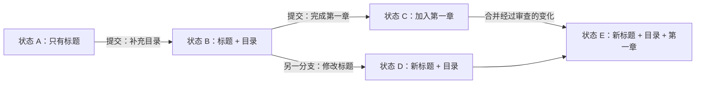
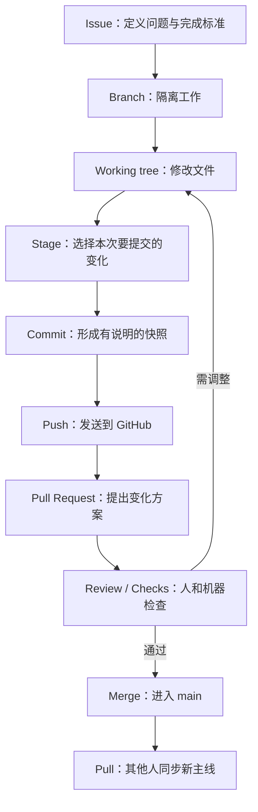

# 第 1 课：GitHub 的思想与心智模型

## 1.1 Git 出现以前，人们怎么合作

想象三个人共同写一本书。大家不断发送：

```text
方案.docx
方案-修改版.docx
方案-最终版.docx
方案-最终版2-真的最终.docx
```

很快会出现四个问题：谁改了什么？为什么改？哪一版可信？两个人同时修改时怎么合并？

Git 解决的不是“文件存在哪里”，而是**变化如何被可靠记录、比较、组合和追责**。GitHub 又在 Git 之上解决：人们如何提出任务、讨论变化、审查结果、决定是否接纳，并让机器自动检查。

## 1.2 最重要的抽象：不是文件，而是变化

普通网盘关心“最新文件”；Git 更关心“从上一个可信状态到现在发生了什么变化”。

这带来一个关键思想：**工作成果不是一坨最终文件，而是一串有因果关系、可解释的变化。**



## 1.3 八个核心概念

### Repository（仓库）：带历史的项目空间

仓库像一个项目文件夹，但它还包含版本历史、分支和协作信息。一个仓库最好围绕一个明确项目，而不是把整台电脑塞进去。

### Commit（提交）：一次有说明的快照

提交不是“保存文件”的同义词。保存只写入当前文件；提交把一组已选择的变化作为一个可命名、可追踪的历史节点。

好提交像积木：小、完整、可理解。提交说明应该回答“做了什么”，必要时补充“为什么”。

### Branch（分支）：从某个历史节点长出的独立变化线

分支不是笨重地复制整个项目，而是一个指向提交历史的轻量引用。它让你在不打扰稳定版本的情况下实验。

`main` 通常表示团队认可的主线。功能、修复和文档更新在独立分支完成，再决定是否合并。

### Merge（合并）：把两条变化线组合起来

合并不是简单覆盖。如果两条分支修改了不同区域，Git 往往能自动组合；若修改了同一处且无法判断意图，就产生冲突，需要人决定。

### Remote（远端）：另一个可同步的仓库位置

你电脑里的仓库叫本地仓库；GitHub 上的仓库是远端仓库。`origin` 通常只是“默认远端”的昵称，不是神秘服务器。

### Push 与 Pull：发送和接收提交

- `push`：把本地已有的提交发送到远端；
- `pull`：把远端的新提交取回并整合到当前本地分支；
- `fetch`：只看看远端有什么新提交，先不整合。

方向始终以“你当前这台电脑”为参照。

### Pull Request（拉取请求，简称 PR）：关于一组变化的正式提案

PR 不是 Git 本身的命令，而是 GitHub 的协作机制。它表达：“我的分支有一组变化，请查看、讨论、检查，并决定是否合入目标分支。”

PR 的真正价值不是按钮，而是把**变化、理由、讨论、自动检查和最终决定**放在同一个上下文里。

### Issue（议题）：在改动发生前先定义问题

Issue 可以是缺陷、需求、问题或任务。成熟协作往往先讲清“为什么做、完成标准是什么”，再动手改。PR 解决 Issue，提交组成 PR。

## 1.4 一张图看懂全流程



注意：文件修改后不会自动成为提交；提交后也不会自动出现在 GitHub；推送后更不会自动进入 `main`。这些刻意设置的门，正是为了让变化可控。

## 1.5 GitHub 的五种思想

### 思想一：历史不能只告诉你“是什么”，还要告诉你“为什么”

文件展示当前结果；提交信息、Issue 和 PR 保存决策背景。半年后真正值钱的往往是“当时为什么这么改”。

### 思想二：并行工作，延迟整合

大家可以先在各自分支推进，到了可验证的节点再整合。这比所有人抢着改一份共享文件更安全。

### 思想三：变化先被看见，再被接纳

PR 把“写完了”与“可进入主线”分开。作者负责提出，审查者负责质疑，自动检查负责重复验证，仓库维护者负责最终取舍。

### 思想四：自动化应围绕事件触发

有人推送、创建 PR、发布版本时，机器可以自动测试、检查格式或部署。这就是 GitHub Actions 的基本思路。

### 思想五：开放不等于没有秩序

开源项目允许陌生人查看和提议，但维护者通过贡献指南、Issue、PR、审查和权限决定什么进入主线。

## 1.6 世界模型：谁在做什么

| 角色 | 关心什么 | 常见动作 | 承担的风险 |
|---|---|---|---|
| 作者/贡献者 | 变化能否被接纳 | 建分支、提交、开 PR | 改动不清楚、破坏兼容性 |
| 审查者 | 变化是否正确且可维护 | 看差异、提问、批准 | 漏掉缺陷或阻塞过度 |
| 维护者 | 项目长期健康 | 排优先级、合并、发布 | 技术债、社区治理 |
| 使用者 | 项目能否解决问题 | 报 Issue、提需求 | 依赖不稳定或不安全版本 |
| 自动化系统 | 规则是否满足 | 测试、构建、部署 | 配置错误、权限过大 |

## 1.7 常见误区

| 误解 | 更准确的理解 | 后果 |
|---|---|---|
| GitHub 就是代码网盘 | 它是围绕版本变化构建的协作系统 | 只上传最终版，历史失去意义 |
| Commit 等于保存 | Commit 是选择变化后形成的可解释历史节点 | 提交过大、无法审查 |
| 分支是项目副本 | 分支是指向历史的轻量变化线 | 害怕建分支，直接改 main |
| PR 是“请求别人帮我写” | PR 是请求目标仓库接纳一组变化 | 不写背景和验证方法 |
| 合并成功就表示正确 | 合并只说明历史能组合，不保证业务正确 | 跳过评审和测试 |
| 删除文件就能删除秘密 | Git 历史可能仍保留秘密 | 凭证持续泄露 |
| Star 等于复制仓库 | Star 是收藏；Fork 才是服务器端副本 | 想修改时找不到自己的版本 |
| GitHub 能代替备份 | GitHub 是一个远端，不应是唯一灾备策略 | 账号或仓库出问题时无恢复路径 |

## 1.8 最小心智模型（按重要性排序）

1. **变化**：Git 的核心对象；学会观察差异，才会用 Git。
2. **提交**：把变化组织成可理解的历史单元。
3. **本地与远端**：解释为什么会有 push、pull、fetch。
4. **分支**：解释并行、实验和隔离。
5. **合并**：解释变化如何重新汇合。
6. **PR**：解释变化如何被讨论、验证和接纳。
7. **Issue**：解释为什么先定义问题再开始改。
8. **工作区与暂存区**：解释为什么“改过”不等于“会提交”。
9. **权限**：解释为什么有人只能提议、有人可以合并。
10. **自动检查**：解释为什么可靠协作不能只靠记忆。
11. **可追溯性**：解释提交说明、关联 Issue 和审查记录的价值。
12. **最小权限与秘密管理**：决定项目是否安全。

## 本课练习

不用查资料，用自己的话回答：

1. Git 和 GitHub 的区别是什么？
2. 为什么 `push` 不等于 `merge`？
3. 为什么成熟团队不鼓励所有人直接修改 `main`？
4. Issue、Commit、PR 三者如何连接？
5. 如果两个人修改不同文件，Git 为什么通常能自动合并？

能讲给一个不懂技术的人听，才算真正理解。
